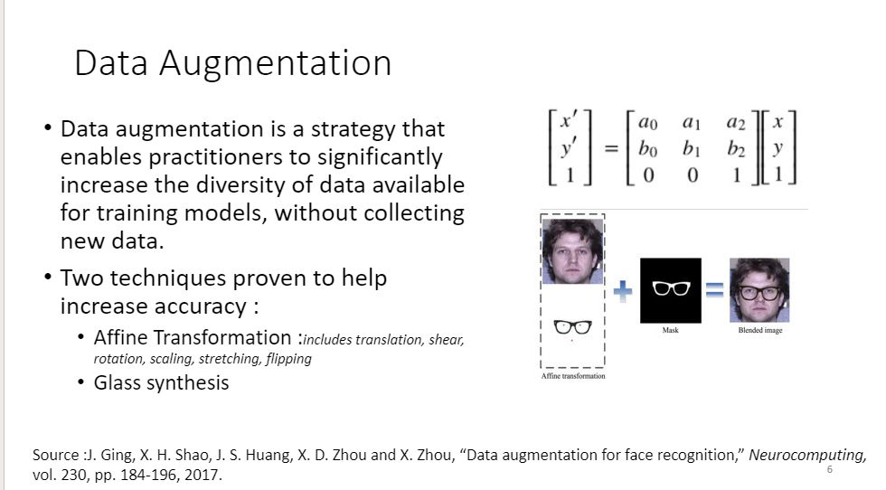
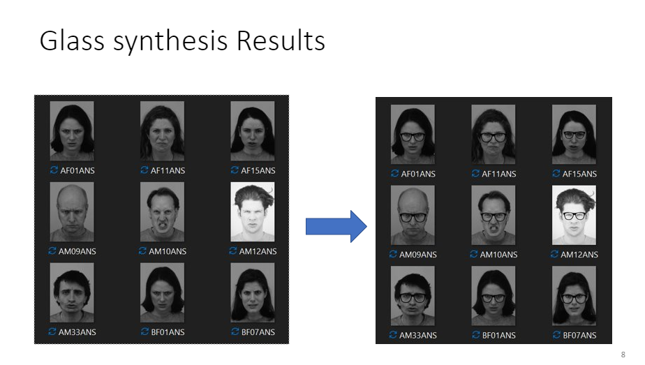

# Glass Synthesis - Data Augmentation Methodology
Glass synthesis to overlay glass mask on a facial image. This is specifically done to increase dataset especially for images with glasses.

## Bried Explanation

## Results
